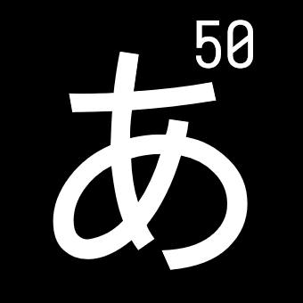

# Gojuon Quiz

[中文](README_zh-cn.md)

A memorization tool for Gojuon, including statistics for accuracy and speed.

[http://nekonull.me/50](http://nekonull.me/50)


## For Developers
- build: `yarn build`
- serve: `yarn serve`

## Node.js Compatibility

This project uses Vue CLI 5.x, which has a dependency (`@achrinza/node-ipc`) that doesn't officially support Node.js 22+. If you encounter the following error:

```
error @achrinza/node-ipc@9.2.8: The engine "node" is incompatible with this module.
Expected version "8 || 9 || 10 || 11 || 12 || 13 || 14 || 15 || 16 || 17 || 18 || 19 || 20 || 21". Got "24.3.0"
```

Run the install command with the `--ignore-engines` flag:

```bash
yarn install --ignore-engines
```

This will bypass the engine compatibility check and allow the installation to proceed.
